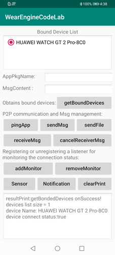
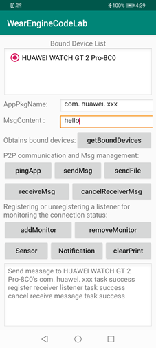
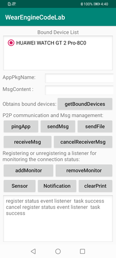
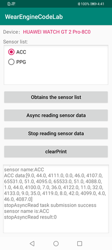
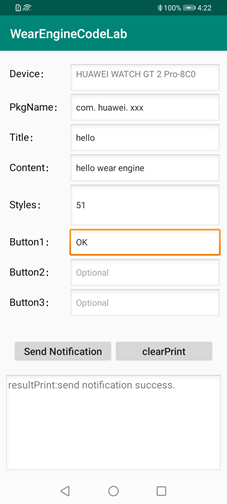

# Wear Engine Phone Demo

中文 | [English](README.md)

## 目录

-   [简介](#简介)
-   [开发准备](#开发准备)
-   [环境要求](#环境要求)
-   [授权许可](#授权许可)

## 简介

Huawei Wear Engine是华为提供的华为智能手表能力开放服务。

面向手机和手表的服务与应用开发者，提供华为智能手表开放能力，实现手机和手表上第三方应用间的消息通信、数据传输等功能。

作为开发者，通过调用 Wear Engine 开放能力，可以实现手机上的第三方应用与服务给华为智能手表发消息，传输数据等。也可以实现华为智能手表上的第三方应用与服务给手机发消息、传输数据等。

Wear Engine开放能力将手机的第三方应用与服务延展到华为智能手表，实现手机与手表能力共享。给消费者提供更丰富的应用场景、更便捷的业务体验、更流畅的人机交互，为第三方应用与服务带来更多流量，创造更多新业务、新交互、新体验。

本项目是Wear Engine服务的Android示例代码，示例代码调用了华为运动健康App提供的Wear Engine服务的Android API接口，实现手机和手表上第三方应用间的消息通信、数据传输等能力，本示例代码只提供Android API的简单调用，仅供参考或受限使用。

Wear Engine服务功能如下：

-   授权

    支持获取对设备能力开放的用户授权。

    代码位置: \\app\\src\\main\\java\\com\\huawei\\wearengine\\app\\WearEngineMainActivity.java  initData\(\)

-   设备连接管理

    支持开发者获取已跟华为运动健康App绑定的设备列表。

    代码位置: \\app\\src\\main\\java\\com\\huawei\\wearengine\\app\\WearEngineMainActivity.java  getBoundDevices\(View view\)

    结果图:

    

-   点对点消息管理

    支持在手机侧与手表侧构建应用到应用的通信隧道，用于收发第三方应用自定义的报文消息以及文件。

    1--手机侧的第三方应用检测手表侧对应的第三方应用是否在线

    代码位置: \\app\\src\\main\\java\\com\\huawei\\wearengine\\app\\WearEngineMainActivity.java  pingBoundDevices\(View view\)

    2--手机侧的第三方应用发送点对点消息或文件到手表侧第三方应用

    代码位置: \\app\\src\\main\\java\\com\\huawei\\wearengine\\app\\WearEngineMainActivity.java  sendMessage\(View view\)  sendFile\(String sendFilePath\)

    3--接收手表侧第三方应用发过来的点对点消息

    代码位置: \\app\\src\\main\\java\\com\\huawei\\wearengine\\app\\WearEngineMainActivity.java  receiveMessage\(View view\)

    结果图：

    

-   设备状态监控管理

    实时监听或查询手表与华为运动健康App的连接状态。

    代码位置: \\app\\src\\main\\java\\com\\huawei\\wearengine\\app\\WearEngineMainActivity.java  registerEventStatus\(View view\)

    结果图：

    

-   传感器

    支持开发者获取已与华为运动健康绑定设备传感器列表，读取传感器数据。

    1--获取当前传感器列表

    代码位置：\\app\\src\\main\\java\\com\\huawei\\wearengine\\app\\SensorActivity.java  getSensorList\(View view\)

    2--异步读取手表传感器数据

    代码位置: \\app\\src\\main\\java\\com\\huawei\\wearengine\\app\\SensorActivity.java  asyncReadSensorData\(View view\)

    3--停止异步读取传感器数据

    代码位置：\\app\\src\\main\\java\\com\\huawei\\wearengine\\app\\SensorActivity.java  stopReadSensorData\(View view\)

    结果图:

    

-   消息通知

    支持开发者向已与华为运动健康App绑定的设备发送通知

    代码位置: \\app\\src\\main\\java\\com\\huawei\\wearengine\\app\\NotificationActivity.java  sendNotification\(View view\)

    结果图：

    

## 开发准备

使用Wear Engine Android示例代码前，请先检查IDE环境是否已安装。

1.  解压示例代码包。
2.  将代码包拷贝到IDE目录下，并导入到IDE工具中。
3.  点击Sync Project with Gradle Files完成开发环境构建。

使用示例代码包中的功能之前，需要设置如下参数（详细操作可参见开发指南中的接入准备和开发准备）：

-   Wear Engine SDK maven地址（示例代码工程中已设置）：
    -   在项目build.gradle的all projects-\>repositories中，配置HMS SDK的maven地址：maven \{url 'http://developer.huawei.com/repo/' \}
    -   在项目build.gradle的buildscript-\> dependencies中，配置HMS SDK的maven配置：maven \{url 'http://developer.huawei.com/repo/' \}

-   编译依赖：在app层级的build.gradle文件中增加编译依赖：implementation 'com.huawei.hms:wearengine:\{version\}'，\{version\}请修改为实际的SDK版本号，如5.0.1.300。
-   AppId信息：在应用的AndroidManifest.xml文件中添加在开发者联盟创建应用时生成的AppId信息。
-   包名：请将包名修改为在开发者联盟创建应用时填写的包名。
-   签名：请在app层级的build.gradle文件中导入签名文件。注意签名文件需与在开发者联盟创建应用时填写的证书指纹匹配。
-   穿戴设备侧指纹：如需体验点对点消息功能，请在WearEngineMainActivity.java文件p2pClient.setPeerFingerPrint\(""\)中输入穿戴设备侧应用指纹信息。

## 环境要求

-   Android Studio V3.3.2 及以上版本
-   Java SDK 1.8 及以上版本

## 授权许可

华为Wear Engine服务示例代码经过[Apache License 2.0](http://www.apache.org/licenses/LICENSE-2.0)授权许可。

