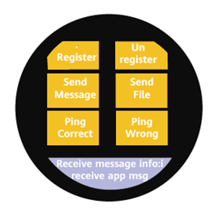

# Wear Engine Lite Wearable Demo

## Contents

-   [Overview](#Overview)
-   [Preparations](#Preparations)
-   [Environment Requirements](#Environment Requirements)
-   [License](#License)

## Overview

HUAWEI Wear Engine provides the open capabilities of Huawei watches.

It is designed for developers of apps and services running on phones and Huawei smart watches.

By integrating the Wear Engine, it will be possible for an app or service on a phone to send messages and transfer data to a Huawei smart watches. This also works the other way round, which means that an app or service on a Huawei smart watch is able to send messages and transfer data to a phone.

The Wear Engine pools the phone and the watch's resources and capabilities, which include apps and services, creating benefits for consumers and developers alike. It enables users to use their devices in more diversified scenarios and receive more convenient services, with a smoother experience. It also expands the reach of your business, and takes your apps and services to the next level.

This document describes the JS sample code for integrating the Wear Engine. The JS sample code calls the JS API of the Wear Engine service provided by the Huawei watches to implement message communication and data transmission on your app between the phone and the watch. This document only provides simple methods to call JS API, and this document is for reference only or is used with restrictions.

The Wear Engine provides the following functions:

-   Authorize

    Configure user authorization for the openness of the device capabilities.

    The code is stored in  **\\entry\\src\\main\\config.json**. Configure metaData in module.

-   Manage point-to-point \(P2P\) messaging

    Create an app-to-app communications channel between the phone and the watch to receive and send the customized packet messages and files on your app.

    1. Check whether your app on the watch is installed

    The code is stored in  **\\entry\\src\\main\\js\\default\\pages\\index\\index.js pingRight\(\)**.

    Result:

    

    The code is stored in  **\\entry\\src\\main\\js\\default\\pages\\index\\index.js  pingFalse\(\)**.

    Result:

    

    2. Send point-to-point messages or files from your app on the watch to that on the phone

    The code is stored in  **\\entry\\src\\main\\js\\default\\pages\\index\\index.jsa sendMessage\(\)**.

    Result:

    

    The code is stored in  **\\entry\\src\\main\\js\\default\\pages\\index\\index.js  sendFile\(\)**.

    Result:

    

    3. Receive the point-to-point messages or files from your app on the phone

    The code is stored in  **\\entry\\src\\main\\js\\default\\pages\\index\\index.js registerMessage\(\)**.

    Result:

    

    Result:

    

## Preparations

Before using the Wear Engine Android sample code, check whether Integrated Development Environment \(IDE\) has been installed.

1.  Decompress the sample code package.
2.  Use DevEco Studio to open the project.

Before using the functions in the sample code package, perform the following:

1.  Apply for a Huawei watch app development certificate.
2.  Modify the signature information in the  **\\build.gradle**  and  **\\entry\\build.gradle**  files.

## Environment Requirements

-   DevEco Studio version 1.0.13.154 or later

## License

The sample code is licensed under the  [Apache License 2.0](http://www.apache.org/licenses/LICENSE-2.0).

