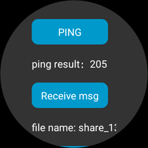
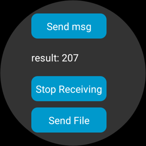
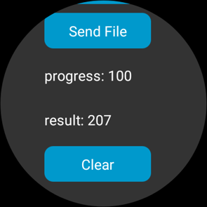
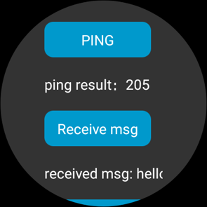

# Wear Engine Wearable Demo

## Contents

-   [Overview](#Overview)
-   [Preparations](#Preparations)
-   [Environment Requirements](#Environment Requirements)
-   [License](#License)

## Overview

HUAWEI Wear Engine is designed for developers of apps and services running on phones and wearable devices.

By integrating the Wear Engine, it will be possible for an app or service on a phone to send messages and transfer data to a Huawei wearable device and even control the device sensors. This also works the other way round, which means that an app or service on a Huawei wearable device is able to send messages and transfer data to a phone.

The Wear Engine pools the phone and the wearable's resources and capabilities, which include apps and services, creating benefits for consumers and developers alike. It enables consumers to use their devices in more diversified scenarios and receive more convenient services, with a smoother experience. It also expands the reach of your business, and takes your apps and services to the next level.

This document describes the sample code for integrating the Wear Engine to your app installed on a wearable device. The sample code calls the APIs of the Wear Engine provided by the Wear Engine SDK to establish an app-to-app communications channel between the wearable device and the phone, allowing them to send and receive customized messages and files. 

This project provides the following functions:

-   Check whether your app has been installed on the phone

    The code is stored in  **entry\\src\\main\\java\\com\\huawei\\wearengine\\wearable\\demo\\slice\\MainAbilitySlice.java startPing\(\)**.

    Result:

    

-   Send point-to-point messages

    The code is stored in  **entry\\src\\main\\java\\com\\huawei\\wearengine\\wearable\\demo\\slice\\MainAbilitySlice.java sendP2pMessage\(\)**.

    Result:

    

-   Send files

    The code is stored in  **entry\\src\\main\\java\\com\\huawei\\wearengine\\wearable\\demo\\slice\\MainAbilitySlice.java sendFile\(\)**.

    Result:

    

-   Receive the point-to-point messages or files from your app on the phone

    The code is stored in  **entry\\src\\main\\java\\com\\huawei\\wearengine\\wearable\\demo\\slice\\MainAbilitySlice.java registerReceiver\(\)  unregisterReceiver\(\)**.

    Result:

    

## Preparations

Before using the Wear Engine Wearable Demo sample code, check whether Integrated Development Environment \(IDE\) has been installed.

1.  Decompress the sample code package.
2.  Use DevEco Studio to open the project.

Before using the functions in the sample code package, perform the following:

1.  Apply for a Huawei watch app development certificate.
2.  Modify the signature information in the  **\\build.gradle**  and  **\\entry\\build.gradle**  files.

## Environment Requirements

DevEco Studio version 2.1 Release or later

## License

The sample code is licensed under the  [Apache License 2.0](http://www.apache.org/licenses/LICENSE-2.0).

